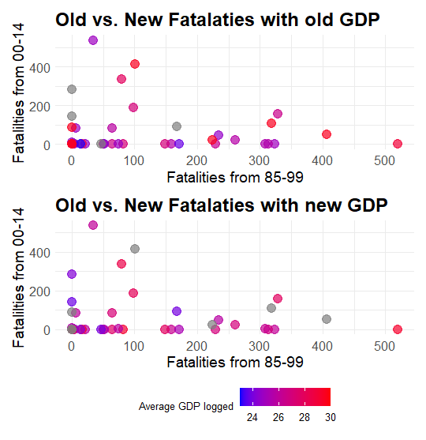

# DS406GP
Group Project

# Should Travellers avoid airlines who had crashed in the past;  


## ERIN:
- Difference in Fatalities plot, in relation to the seat flight
```
airlines <- airline %>%
  mutate(
    incidents_85_99_rate = (incidents_85_99 / avail_seat_km_per_week) * 1e9,
    fatal_accidents_85_99_rate = (fatal_accidents_85_99 / avail_seat_km_per_week) * 1e9,
    fatalities_85_99_rate = (fatalities_85_99 / avail_seat_km_per_week) * 1e9,
    
    incidents_00_14_rate = (incidents_00_14 / avail_seat_km_per_week) * 1e9,
    fatal_accidents_00_14_rate = (fatal_accidents_00_14 / avail_seat_km_per_week) * 1e9,
    fatalities_00_14_rate = (fatalities_00_14 / avail_seat_km_per_week) * 1e9
  )


airlines %>%
  filter(fatalities_85_99 > 50) %>%
  mutate(change = fatalities_00_14_rate - fatalities_85_99_rate) %>%
  ggplot(aes(x = reorder(airline, change), y = change)) +
  geom_col(fill = "steelblue") +
  coord_flip() +
  labs(title = "Change in Fatalities per ASK",
       y = "Change (00–14 vs. 85–99)", x = "Airline")

```

## Louis:


- Including GDP and adding that as a reason.  
- Conclusions

## Robert


- incidents vs fatal accidents for both 1985-1999, and 2000-2014.

```
data <- read_csv("~/GroupProjectDS406/1AirlineSafety (2).csv")

Incidents_Accidents <- data %>%
  pivot_longer(
    cols = c(incidents_85_99, fatal_accidents_85_99,
             incidents_00_14, fatal_accidents_00_14),
    names_to = c("metric", "period"),
    names_pattern = "(.*)_(\\d{2}_\\d{2})",
    values_to = "value"
  ) %>%
  pivot_wider(
    names_from = metric,
    values_from = value
  ) %>%
  mutate(period = recode(period,
                         "85_99" = "1985–1999",
                         "00_14" = "2000–2014"))

ggplot(Incidents_Accidents, aes(x = incidents, y = fatal_accidents, color = period)) +
  geom_point(size = 3, alpha = 0.7) +
  scale_color_manual(values = c("1985–1999" = "blue", "2000–2014" = "red")) +
  labs(
    title = "Incidents vs Fatal Accidents for both 1985-1999 and 2000-2014",
    x = "Incidents",
    y = "Fatal Accidents",
    color = "Period"
  ) +
  theme_minimal() +
  theme(
    plot.title = element_text(size = 20, face = "bold"),
    axis.title = element_text(size = 16),
    axis.text = element_text(size = 16),
    legend.title = element_text(size = 16),
    legend.text = element_text(size = 14)
  )
```


## Aaron
- Issue: Plot is too similar to Erin's
- Maybe make a nicer ggally like so:


## Diaries:  
From the April 
- Discussed over that 

### Conclusion: 
- We can state waht we see from the plots and we need more data to come up before any conclusions,  

### GGALLy GGPAIRS:

- correlation between incidents from 1985-1999 and incidents 2000 - 2014


# What's left:
1. Change plots to match Robert's type - created above  
2. Meeting during the break. Probably Online.
3. Work on the presentation slides which is **due on the 25th Friday**
4. Write Report - **Due 25th friday**
  - Erin: write the introduction
  - Aaron - do more the ggpairs plot, and finish the Diary, Methods
  - Robert: Results section. Diary with Aaron.   
  - Louis: write the discussion and include gdp data. 
